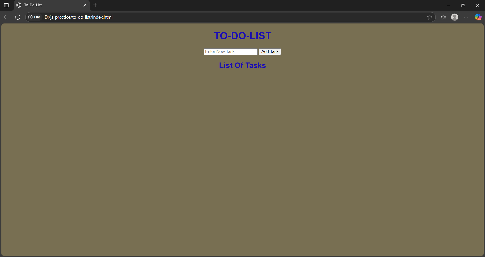

# To-Do List App

This is a simple and clean to-do list web app I built using just HTML, CSS, and JavaScript. It’s a beginner project to practice basic DOM manipulation and localStorage.

## What It Can Do

- Add new tasks easily
- Mark tasks as done (adds a line through the text)
- Delete tasks with a button
- Press "Enter" to quickly add a task
- Saves your tasks even if you close the browser
- Works on both desktop and mobile screens

## How to Use

1. Open the `index.html` file in your browser.
2. Type a task in the input field.
3. Click the "Add Task" button or just hit **Enter**.
4. To mark a task as done, click on it.
5. To remove a task, click the **Delete** button next to it.

## Built With

- HTML (structure)
- CSS (styling)
- JavaScript (functionality)

No frameworks or libraries were used—just plain code.

## Why I Made This

I wanted to practice how to:
- Use JavaScript to interact with the DOM
- Handle events and user input
- Store data in localStorage
- Build something responsive without using Bootstrap

## License

MIT License — feel free to use or change it however you like.

---

> Feel free to clone this and make your own version! If you're also learning, hope this helps 😊
